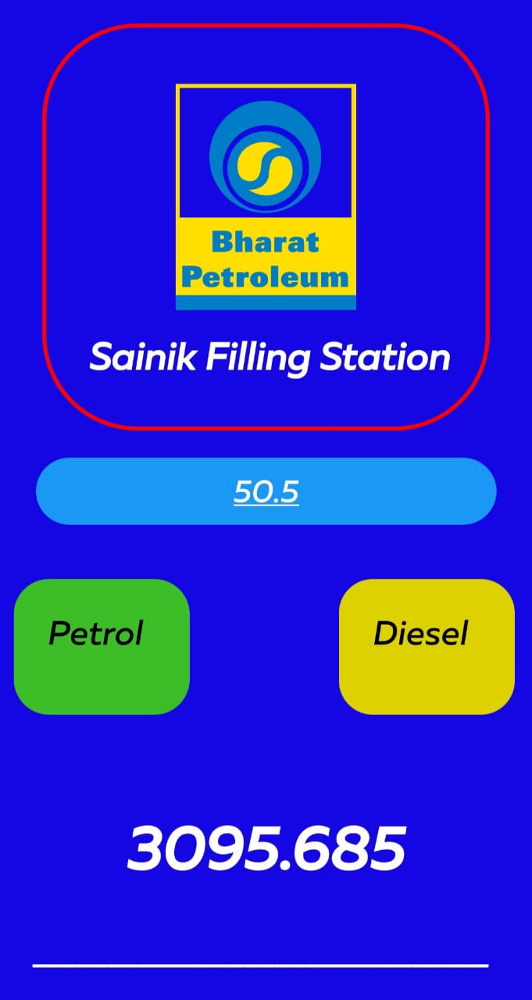
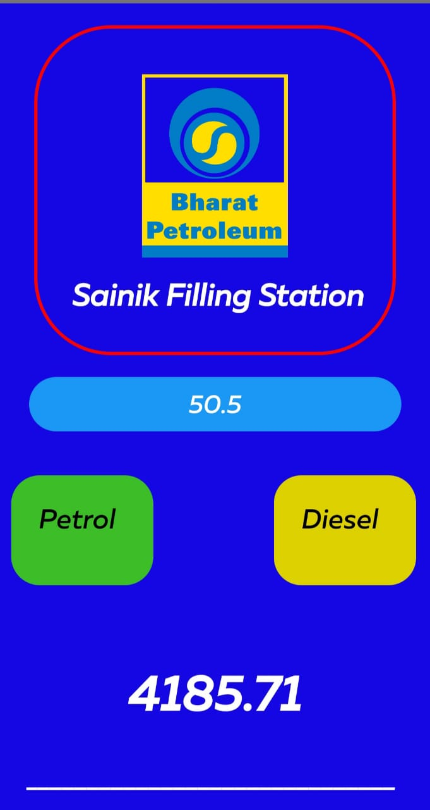

**This project is useful for all of those who is having petrolbunk**.

They Can **convert Dipping Height of fule to quantity in liters**
Basically, User will enter dipping height, some Internal calculation will be perform by app with help of some database and it will return **quantity of fule in lites**.

this Project is done for my 1st costumer **Sainaik Filling Station, Rajasthan**

Logo Of Bharat Petrolium 

HomePage

Petrol Quantity

Deisel Quantity 
